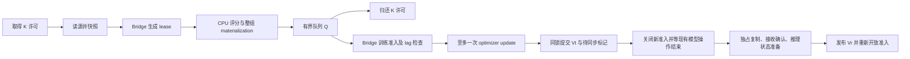

# R0–R3：异步策略流水线设计

本阶段交付实验性 completion 调度核心及可替换的引擎适配协议，保持上游 GRPO 的数据和 loss 语义。入口是 `areno.experimental.async_policy.AsyncPolicyPipeline`。R4 首轮已增加原生 GPU / NCCL 适配；不新增算法名称、CLI 或公开 Trainer 配置。

| 唯一所有者 | 管理内容 |
|---|---|
| Supervisor（pipeline 与 bridge 共享） | 生命周期、停止信号、首个异常；失败唤醒所有等待者 |
| Coordinator | Vt / Vr、生成 / 训练 lease、同步请求合并；同一条件锁保护准入与版本提交 |
| Producer | 唯一源迭代器、至多 K 个生产任务；取得许可后才读源，任务入队或终止才归还 |
| 训练主线程 | 消费、batch 决策和指标；后续 checkpoint 也归此线程所有 |

状态：`NEW → INITIALIZING → READY → RUNNING → DRAINING → STOPPING → CLOSED`。初始化必须实际复制，即使初始 Vt = Vr = 0。EOF 先等所有已接收任务入队再 drain，最后补齐权重；max_steps / 外部 stop / abort 关闭准入并丢弃剩余工作。任何阶段异常进入 `FAILED`，清理成功后进入 `CLOSED`，但报告始终保留 failed 与原始异常。关闭超时也是失败；允许在操作退出后再次 close 完成清理，不能先成功返回再后台收尾。

生成引擎 session 串行；ASYNC 模式允许一份生成与一份训练重叠，SYNC 模式两个方向都互斥。CPU 评分和 queue / permit 等待不占模型 lease。Vb 在生成准入时捕获；训练准入后检查 `0 ≤ Vt − Vb ≤ lag`，过期整批丢弃，future version 报错。仅适配器明确返回 `stepped=True` 才递增 Vt；零梯度也可能真实 step，不能看 loss 或参数差猜测。提交 Vt 的同一锁内设置同步需求：达到 C，或继续生成将超过 lag。多个同步调用等待同一次传输；超时使用单个单调时钟截止时间。传输返回必须意味着完整复制、接收确认及推理状态准备结束；部分失败不回滚版本冒充恢复，而是禁止后续模型操作。

所有发布数据必须是 CPU、无计算图。读源时复制 prompt，释放生成 lease 前复制 rollout，materialization 再复制训练 payload；普通容器、数值 NumPy 数组、无梯度 CPU tensor 可用，其他对象拒绝。冻结 envelope 只保护元数据；其内部 TrainSequence 由训练消费者独占，生产者不得保留可修改的别名。完整 prompt group 先评分，再复用上游 group advantage 构造 rows；reward 使用上游 `RewardRecord`，可直接读取实际 tokens，文本评分可传入 decoder。

适配器的 initialize / generate / train / transfer / close 必须遵守传入的剩余超时；reward 与源迭代器必须及时返回或合作取消（可观察 pipeline.stop_event）。Python 不能安全强杀任意线程。停止依次唤醒队列 / 许可 / lease 等待者，等待 producer 与其有界任务退出，再等待模型操作并关闭引擎。超时报告仍存活的资源，不提前关闭正在使用的模型。

`pipeline.run()` 无论初始化是否成功都执行一次统一收尾，整个收尾共用一个截止时间；不会失败后自动重置预算再试。单独使用 bridge 时，调用者须把 initialize 也放进 `try/finally: close()` 范围。首个异常原样抛出，收尾等次生异常以及剩余线程 / lease 另存入 report；显式再次 close 可完成后续回收。

**R4 原生 GPU 接入**

`native.NativeCudaEnginePair` 为两个独立单卡分区提供 train / rollout / weight_sync 适配器，复用现有 `TPCluster`、`ArenoWorker`、training pack、既定 GRPO loss 和 NCCL policy transfer。首版只接受已解析到本地的真实 checkpoint、文本 completion、TP=1 / DP=1 和互不重叠的设备；远程模型由启动器先通过 ModelScope 获取。

pair 的 train 端点拥有两组 worker 和共同的 TCPStore；rollout 端点不重复关闭它们。初始化两个分区共用一个截止时间；各次原生 RPC 使用剩余预算。多 microbatch 累积成一次更新，直接读取 worker 的 stepped / global_step，不从 loss 或参数变化猜测更新。配对同步同时发出 publish / receive，并检查双方完成事件，任一方失败即可传播，避免先阻塞等发送者而漏看接收者错误。

收尾先请求两个分区退出，再在同一个预算内 terminate / kill 未合作的进程并 join，最后关闭结果泵、队列和进程句柄。无法确认资源退出就报告超时。pair 不另外维护 Vt / Vr 或同步准入，所有使用均通过 bridge；部分传输失败后由共享 supervisor 禁止继续运行。

GPU 验证工具中的 checkpoint 保存由训练消费者在 lease 内发起；同步核验在独占同步区内导出两端 LoRA 张量。专用测试 worker 记录真实操作、显存和 GPU profiler 事件，故障注入只存在于 tests。`max_steps` 仍按既定契约立即停止，因此最后 Vt=5 / Vr=4 合法；最终保存并重载的是训练版本 5。完整 checkpoint / optimizer 续训、编译 / CUDA graph 和长期性能验收不由首轮短测试覆盖。

验收入口见 [重写 TODO](REWRITE_TODO.md) 与 [已知问题](KNOWN_ISSUES.md)。原始运行输出只写到忽略的 `runs/async-policy-rewrite/`。
