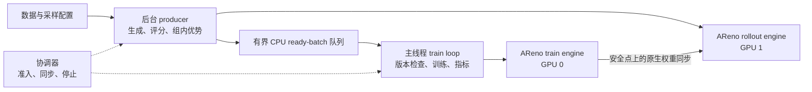

# AReno 原生异步策略训练器：实施方案

版本：v1.0，2026-09-14。用途：供项目负责人、实现者和评审者讨论、排期与验收。

本方案建议用 **8 周完成首版交付，另留 2 周缓冲**：先在本机建立 CPU 调度闭环，再接入 AReno 原生双引擎，在云端单机多 GPU 上完成真实训练、故障验证和吞吐对照。
现有同步基线已经完成；本文描述的完整异步 trainer、配置和新文件均为待实现内容。

执行入口是 [TODO.md](./TODO.md)。官方中英文原文及 D1–D5、R1–R9 的定义见 [PROJECT_REQUIREMENTS.md](./PROJECT_REQUIREMENTS.md)，代码现状见 [REQUIREMENTS_AUDIT.md](./REQUIREMENTS_AUDIT.md)，已完成实验见 [BASELINE_REPORT.md](./BASELINE_REPORT.md)。

## 1. 项目要解决什么问题

AReno 是本地一体化模型训练与推理框架。本课题处理的是已有语言模型的强化学习后训练：对同一个 prompt 生成多条回答，用 reward function 评分，计算组内相对优势，再更新策略模型。首版采用 GRPO 和可验证答案的算术任务，验证训练系统能否正确运行。

目前每批依次执行 rollout → reward → advantages / TrainSequence → train。异步改造让训练 GPU 消费上一批时，生成 GPU 可以准备后续批次，以减少阶段间等待。模型更新后，生成端通过 AReno 自有的权重传输机制获得新策略；排队的旧样本需要明确的版本和过期处理。

这是一个训练框架工程项目。0.6B 模型和 LoRA 足以作为系统验证起点；商业大模型涉及更大的显存、并行拓扑和质量验证成本，不能从小模型 smoke 推导出其可用性。课题没有要求从零预训练商业大模型，也没有规定固定加速百分比。

同步训练是完整且有效的默认方式。异步增加队列、旧策略样本和同步开销，是否更快取决于实际瓶颈。项目成功首先要求实现正确、可复现的实验能力，并如实回答目标工作负载是否受益。

## 2. 已有起点与尚缺能力

2026-09-14 已重新获取上游引用并查询相关 PR / issue 元数据，结果如下；详细代码审查和训练证据仍采用各文档原始日期。

| 对象 | 已核实状态 | 本方案如何使用 |
|---|---|---|
| 上游 main | `60e2fa73f331ea5f5f7245f0793084fbebe9d76c`，与 09-13 审查版本一致 | 作为设计和回归基线；开工时再次记录实际基线 |
| 同步 GRPO 基线 | Qwen3-0.6B、LoRA、3 次真实 optimizer updates、保存及重载；09-13 完成 | 已完成，不重复列为开发成果；云端另建同资源对照 |
| 独立 train / rollout engines | 设备划分、TP / DP、原生生成与训练已有 | 复用资源管理和 GPU worker 进程 |
| 原生权重同步 | NCCL 传输、LoRA / 全参数 plan、布局映射及推理缓存失效已有 | 新增并发调度协议，复用底层传输 |
| 本地协调器 `5248ac2` | 有 lease / version / timeout 原型；存在 pending-sync 准入缺口 | 先移植、补测试和修复，再集成；不是完整流水线 |
| [PR #480](https://github.com/inclusionAI/AReno/pull/480) | OPEN，未合并；head `01e6baf20b02394f5fabbde8f170cc1ac4c53b57` | 评估其批次、队列组件，避免重复设计；采用时保留来源与作者信息 |
| [Issue #487](https://github.com/inclusionAI/AReno/issues/487) | OPEN，描述方案 | 参考讨论，不把其中接口、默认值当成现有能力或官方要求 |

仍需实现：实验 trainer、后台生产与消费、有界 ready 队列、inflight 限制、统一策略版本和 staleness、并发 backend 接入、同步安全点、失败退出、指标、真实多 GPU smoke 和性能报告。

三个工程难点已经明确：

1. 当前 `CudaBackend.train` 在独立 rollout session 活跃时拒绝训练。必须建立实验模式的并发协议，单纯删除检查不能保证权重与状态安全。
2. 当前 SDK 与 backend 的 step / timing / metrics 假定顺序调用，不能直接让两个线程共享这些可变状态。
3. 当前 GRPO loss 不用 rollout old logprobs 构造行为策略重要性比值。首版按官方要求复用 loss，同时限制策略延迟并验证影响。

## 3. 首版范围与交付对应关系

本节的接口选择、测试规模和验收办法是实施建议。官方要求来源只有中英文课题说明，见需求文档；比赛日程已于 2026-09-14 核实：OSPP 2026 全流程滚动开放、无固定截止日期，开发周期以项目详情为准（本课题 3 个月），中选公示前的开发不计入结项，详见 [TODO.md](./TODO.md) 第 0 节。

| 官方交付 | 首版交付物 | 对应任务 | 验收项 |
|---|---|---|---|
| D1 实验异步 trainer | `areno.experimental` 下可调用的 GRPO trainer，复用现有 loss | T01、T02、T04、T05、T06 | A01、A02、A04、A07 |
| D2 worker / train loop 生命周期 | 初始化、后台生产、消费、drain、abort、错误传播与回收 | T03、T04、T05、T11 | A03、A05 |
| D3 AReno-native 权重同步 | 原生传输接入、安全点、成功确认及版本发布 | T06、T07、T10、T12 | A04、A06、A08 |
| D4 文档及单机多 GPU smoke | 功能分支内独立可运行的示例、说明、实测证据与限制 | T09、T10、T15、T16 | A07、A10、A12 |
| D5 bounded queue 配置 | queue size、inflight work、sync cadence 三类控制 | T01、T03、T04、T07 | A03、A04、A06 |

| 官方约束 | 落实方式 |
|---|---|
| R1、R2 | 实验包内先提供 GRPO trainer class；用户显式选择 |
| R3、R4 | 使用现有 `grpo_loss_fn`；调度器不写死 token / sequence loss 公式，为后续 GSPO 保留注入点 |
| R5 | 有界队列、在途预算、消费侧版本检查、主动触发同步 |
| R6 | 首先支持单机两张不同 GPU，train / rollout 各一张；证明真实重叠 |
| R7 | 默认同步 GRPO / GSPO 调用和行为保持原样，单独回归 |
| R8、R9 | 复用 AReno 引擎和 NCCL，不增加 vLLM / SGLang 或外部调度服务 |

首版工作负载选择文本 completion、单个后台 producer、单个训练写入者、TP=1 / DP=1 的两个设备组。LoRA 是第一个 GPU 闭环；随后用小模型补充全参数权重同步与实际更新验证，避免设计只适用于 adapter version。

以下作为后续扩展，不占首版关键路径：GSPO 具体接入、完整 Agentic 工具链、多模态、多节点、多 producer engines、复杂 TP / DP 组合、无暂停的权重双缓冲、精确恢复在途队列、商业模型质量验证。背景中的 Agentic 场景是设计动机，首版应保留接口空间；尚未支持的输入需要明确拒绝，不能静默降级。

`async-grpo` / `async-gspo` CLI 名称不是首版必选项。优先提供实验 class 与可运行 SDK 示例；若后续加入算法入口，应走 registry，并检查 backend capability 校验，不能只新增一个名字。

## 4. 总体架构和职责

| 部件 | 建议职责与所有权 |
|---|---|
| 主线程 / supervisor | 唯一拥有 init / close、训练提交、同步决策、checkpoint 和训练指标写入权；处理 Ctrl-C |
| producer 线程 | 拥有数据迭代器和一个长期 event loop；负责 rollout、CPU 评分、样本构造与入队 |
| 生产任务预算 | 最多 K 个已接收但尚未入队 / 终止的任务；同一 rollout engine 的 session 操作首版串行 |
| 训练引擎 | 唯一可以更新策略权重的设备组 |
| 生成引擎 | 使用最近一次成功同步的完整策略版本；生成期间该版本不变 |
| 协调器 | 管理短临界区内的版本、活跃 lease、pending sync、停止状态；不在锁内执行 CUDA / RPC / 阻塞队列操作 |
| 实验 backend bridge | 连接既有引擎与实验协议，隔离顺序 SDK 的 step / metrics 状态，提供实际更新及同步结果 |
| 控制通道 | 独立于 ready 队列传递结束、错误、同步请求；满队列不能阻塞错误传播 |

先复用 AReno 已有的 `spawn` GPU worker 进程和 `TPCluster` 请求分发，不另建一套 CUDA 多进程运行时。producer 是 CPU 调度线程，不持有另一套可训练 GPU 模型。引擎在主线程初始化完成后才启动 producer，避免多个线程竞相启动同一 cluster。

K 大于 1 时，可以让已生成批次的 CPU 工作与下一批生成交错；它不表示同时启动 K 套模型或 K 个互相冲突的 rollout sessions。CPU 执行器也必须有界。首个 smoke 用 K=1，先验证 rollout 与 train 之间的重叠。

现有同步方法可复用其纯样本处理逻辑；日志、dashboard 和 step 相关副作用需拆开。所有结果带 batch ID，主线程统一汇总到训练步，producer 不修改 SDK 的 `global_step`。

## 5. 批次、容量和数据语义

以完整 materialized prompt batch 为一个队列元素。一个 prompt 的 n_samples 条 completion 必须先全部评分并完成组内优势计算，才可进入 ready 队列；不按先完成的单条回答提前训练。

建议批次信封包含以下字段。名称是拟议接口，实施时应与可复用组件对齐。

| 字段 | 语义 |
|---|---|
| `run_id`、`batch_id`、`epoch`、`prompt_ids` | 唯一定位数据和一次生产任务；跨运行不复用旧批次 |
| `policy_version` | 获得 rollout lease 时确认的生成策略版本 |
| `sequences`、`group_offsets` | 既有 `TrainSequence` 列表及 prompt group 边界 |
| `rewards`、组统计 | 与原 completion 顺序对应；advantages 复用既有计算 |
| token / mask / logprob 数据 | 保留 prompt 与 response 边界、真实生成 logprobs、loss mask 和截断信息 |
| 阶段时间及数量 | 生产起止、入队时间、prompt / completion / 有效 response token 数，用于可追溯指标 |

入队后生产端不得修改批次。队列保存 CPU 数据，不持有计算图、GPU KV cache 或大模型 tensor 引用。若采用 PR #480 的类型，需要检查字段和关闭语义是否覆盖本契约，不能仅因名称一致就直接接线。

容量采用三个不同的概念：

- **Q：ready queue capacity**，已经准备好、尚未取走的批次数量。
- **K：max inflight rollouts**，已获得生产许可、尚未成功入队或终止的任务数量；包括生成、评分、materialize 和等待 put。
- **推理请求并发**，由已有 `max_running_prompts` 管理；它控制生成引擎内请求，不替代 Q 或 K。

先获得 inflight permit，再读取下一份工作；任务成功入队或明确丢弃后才释放 permit。不要先为全部数据创建 futures 再用 semaphore 限流。消费者至多额外持有一个批次，因此首版驻留批次上界为 **Q + K + 1**，另计引擎缓存、评分执行器和 IPC 的有界开销。

批次数量有界不等于任意输入的字节数有界。还要限制 prompt 长度、max_new_tokens、batch size、n_samples 和元数据体积；记录队列字节估计及主机 RSS。首版不为未来多模态 payload 承诺同样的内存上界。

对缺样本、错序、非有限 reward / logprob、非法 mask 的批次明确报错，避免生成看似正常但语义损坏的训练输入。合法的同奖励组允许零 advantage；空训练批次记录并跳过。stale 丢弃以整个信封为单位，不拆散组来凑新批次。

## 6. 策略版本、训练步和 staleness

令 Vt 为训练策略版本，Vr 为生成引擎已确认加载的版本，Vb 为批次生成版本。初始版本由 bridge 在两端权重对齐后确认；在一次运行内，Vt 每完成一次真实 optimizer update 增加 1。

消费时使用 **lag = Vt − Vb**，且必须在取得训练准入、确认当前 Vt 后重新计算。允许 `0 <= lag <= max_policy_lag`；超界丢弃并计数。Vb 大于 Vt 属于协议错误，直接失败，不截断成 0。

训练步的定义必须与 backend 实际行为一致：

1. mini-batch forward / backward 数量、取出的队列元素数和 optimizer updates 是三个不同计数。
2. 基线 `TrainingManager.train` 默认把本次调用的所有 packs 累积为一次更新；显式较小的 accumulation 值可能导致一次调用产生多次更新。
3. **首版约束一个非空 ready batch 至多产生一次 optimizer update**，使用整批 accumulation；会产生多次更新的设置先拒绝并说明原因。这样一次 staleness 检查覆盖整个更新。
4. bridge 从真实执行结果确认是否 stepped，而不是看到 `train()` 返回就假定更新成功。后续支持多更新时，需按实际 updates 计数，并在每个更新边界重查 lag / sync / max_steps，不能简单累加一次。
5. 零梯度不等于没有执行 optimizer：若实际执行了 update，版本仍推进。空批次、stale drop、明确跳过的更新不推进版本。
6. 训练异常可能发生在部分权重已经改变之后；首版终止运行，不重放该批次以冒充安全重试。

通用版本不能依赖可选 `adapter_version`。LoRA 时可用它交叉核对，并说明起始计数映射；全参数路径也必须有同样的版本契约。既有 backend 的按调用更新版本逻辑不能直接当作所有配置下的真实 optimizer 计数。

实验 trainer 的 `max_steps` 建议明确表示成功 optimizer updates 上限，单独记录 `batches_seen / trained / dropped / empty`；现有同步 trainer 的 step 语义保持原样。有限数据耗尽而未达到上限时，正常结束并报告实际更新数，不自动无限重复数据。

同步采用双触发：通常每完成 C 次更新触发；若 Vr 已无法继续生产可接受的批次，或消费侧发现旧批次且生成端还落后，则提前请求同步。C 是正常间隔，不能压过 staleness 上限。若两端版本已相同，只清理旧队列并等待新批次，不能反复执行无效同步。

`max_policy_lag=0` 是诊断模式：只训练当前策略生成的批次，可能大量丢弃并退化为顺序执行。它不能同时保证充分重叠。真实异步首个 smoke 建议从 lag=1 开始，记录实际分布后再调整。

## 7. 同步安全点与无死锁协议

同步继续使用 AReno 原生 tensor plan、NCCL publish / receive 和缓存失效逻辑，首版在安全点暂停两端模型操作。CPU 评分若只使用已经生成的 CPU 数据，可以继续执行。

建议顺序如下：

1. 在协调器短临界区内先置 `sync_pending`，合并重复请求，并关闭新的 rollout / train 准入。修复现有原型“等活跃工作归零后才设置同步状态”的饥饿问题。
2. 等待已开始的训练更新完成，等待已有 rollout 的所有模型请求和 session 收尾完成。不能把 Python future 被取消当成 GPU 已停止。
3. 两端都到安全点后，固定目标 Vt。源权重在整个传输中不得更新，目标不得被 rollout 读取。
4. 刷新并验证当前活跃 tensor 布局；offload / onload 可能替换 storage，不能复用失效的 tensor view。
5. 向发布端和接收端先分别提交匹配的原生传输请求，再等待所有参与 rank 完成；不能先阻塞等待发布而尚未提交接收。
6. 确认接收、缓存清理和推理权重准备完成后，才发布新的 Vr；记录耗时、字节数、源版本与目标版本，再开放准入。
7. 任意 rank 失败、超时或部分传输异常，记录根因并关闭整个流水线。版本没推进不代表 tensor 已回滚；首版不继续使用部分覆盖的模型。

必须遵守以下等待规则：

| 等待位置 | 必须满足的条件 |
|---|---|
| producer 等待队列 put | 已结束 GPU rollout session、释放 rollout lease；不得持协调器锁 |
| CPU 评分 / materialize | 只依赖本批 CPU 数据时释放 GPU lease；仍占 inflight permit |
| 主线程等待 queue get | 不持 train lease；可被控制事件唤醒或短超时返回，优先处理同步 / 停止 |
| 主线程发现 pending sync | 先执行同步控制流程；不能阻塞等一个只有自己才能清除的 pending 状态 |
| 训练提交 | 准入检查、捕获 Vt 与 staleness 复查形成同一受控边界 |
| 完成更新并达到同步条件 | 在同一状态更新中推进 Vt 并设置 pending，避免额外工作从缝隙进入 |
| 同步 / 关闭 | 不需要先清空 ready 队列；队列满也应能到达安全点 |

关键回归场景是：Q=1、队列已满、producer 正等待 put、此时同步到期。同步必须能够完成，消费者随后继续；不能出现“同步等 rollout lease，producer 持 lease 等消费，消费等同步”的循环等待。

初始化同样需要确认两端权重一致，包括 LoRA 初始化或加载 checkpoint 后的状态；不能仅因为两个计数值相同就略过对齐。首版只支持在新运行中加载权重、清空队列并重新对齐，不承诺恢复中断时的全部 RNG、数据位置和在途工作。

## 8. 生命周期、异常和保存

建议整体状态为 `CREATED → STARTING → RUNNING → DRAINING / STOPPING → CLOSED`；异常记录 `FAILED` 原因后进入统一清理。同步是 RUNNING 内部的互斥阶段，不创建第二套生命周期。

| 触发条件 | 预期行为 |
|---|---|
| 启动成功 | 验证配置、初始化两个引擎、初始权重对齐，再开放生产与消费 |
| 启动到一半失败 | 回收已经创建的引擎 / 线程 / IPC；向调用者返回原始原因 |
| 数据 / epochs 耗尽 | 停止新增生产，等待已接收任务结束，关闭生产端；消费者处理剩余有效批次后退出 |
| `max_steps` 达到 | 停止新增生产与训练，剩余队列 / 在途结果不再训练并单独计数，完成必要收尾 |
| 队列暂空 | 等待数据或控制事件；不误判为 EOF |
| reward / materialize 抛错 | 保存 batch ID、阶段和异常，停止整条流水线；不把错误变成空批次 |
| worker / NCCL / train 异常 | 首个根因经控制通道传播；禁止新模型操作，终止并回收本次运行拥有的 worker |
| 用户中断 | 主线程发出停止，唤醒所有 queue / permit / lease 等待者，清理后以中断状态返回 |
| 等待超时 | 区分操作超时与正常轮询；输出活跃任务和版本，进入失败清理 |
| 重复 close | 幂等；既不重新启动线程，也不重复消费 / 训练 |

EOF / error 标记走独立控制状态，不能靠向满队列插入 sentinel 才能退出。需要区分“生产已关闭但仍可 drain”和“abort 后队列不再可用”。清理次序是先关闭准入和唤醒等待者，再结束可取消任务、回收引擎和执行器，最后汇总指标；不得先无限 join 一个正在等待 GPU RPC 的线程。

Python 线程不能安全强杀，`asyncio.wait_for(asyncio.to_thread(...))` 超时也不代表后台函数停止。首版使用可及时返回或合作取消的本地 reward；任意不可取消外部工具调用不在此保证范围。若首版必须接纳这类 reward，应先在 T01 调整范围，将其放入可独立终止的 spawn 进程，并纳入生命周期测试。不能写“支持超时”却遗留仍运行的评分线程。

checkpoint 只由训练主线程在成功 update 边界保存，保存期间不与权重发布或下一次训练写入竞争。正常结束可以按配置保存；错误退出不自动把可能损坏的状态覆盖到上次成功 checkpoint。证据中记录保存时的训练版本。正式说明要区分权重加载验证与完整训练状态恢复。

## 9. 代码接入边界

下表的新模块名称仅用于拆分责任；最终文件结构在 T01 固定。链接指向已审查的上游代码，不能把提议的类或方法当成现有可调用接口。

| 位置 | 建议改动 / 复用边界 |
|---|---|
| `areno/experimental/async_policy/`（拟新增） | 配置、批次契约、队列、协调器、producer、trainer；按复杂度拆文件，避免构造通用分布式平台 |
| [policy_only.py](https://github.com/inclusionAI/AReno/blob/60e2fa73f331ea5f5f7245f0793084fbebe9d76c/areno/api/trainers/policy_only.py) | 复用 rollout 参数、reward / advantages / materialize 语义；需要提取纯 helper 时补等价性回归 |
| [trainer.py](https://github.com/inclusionAI/AReno/blob/60e2fa73f331ea5f5f7245f0793084fbebe9d76c/areno/api/trainer.py) | 保留 `from areno import Trainer` 作为基础 SDK；实验 bridge 隔离 session / global_step / metrics 所有权 |
| [CUDA backend](https://github.com/inclusionAI/AReno/blob/60e2fa73f331ea5f5f7245f0793084fbebe9d76c/areno/api/backend/cuda/backend.py) | 为实验协议提供窄接口；独立设备模式才允许受控重叠；同步模式继续原检查和 lazy sync 行为 |
| [engine API](https://github.com/inclusionAI/AReno/blob/60e2fa73f331ea5f5f7245f0793084fbebe9d76c/areno/engine/api.py) / [TrainingManager](https://github.com/inclusionAI/AReno/blob/60e2fa73f331ea5f5f7245f0793084fbebe9d76c/areno/engine/training.py) | 接出实际 stepped 信息；首版约束一次调用的一次更新语义，不改优化算法 |
| [policy_sync.py](https://github.com/inclusionAI/AReno/blob/60e2fa73f331ea5f5f7245f0793084fbebe9d76c/areno/engine/policy_sync.py) / [worker.py](https://github.com/inclusionAI/AReno/blob/60e2fa73f331ea5f5f7245f0793084fbebe9d76c/areno/engine/worker.py) | 复用 plan、publish / receive、推理状态重建；补足异步调用所需的确认和错误边界 |
| [protocol.py](https://github.com/inclusionAI/AReno/blob/60e2fa73f331ea5f5f7245f0793084fbebe9d76c/areno/engine/protocol.py) | 复用 spawn、请求 ID 和 result pump；验证超时 / close 能使实验调用者退出，不假定所有共享状态天然线程安全 |
| [algorithms.py](https://github.com/inclusionAI/AReno/blob/60e2fa73f331ea5f5f7245f0793084fbebe9d76c/areno/api/algorithms.py) / [CUDA losses](https://github.com/inclusionAI/AReno/blob/60e2fa73f331ea5f5f7245f0793084fbebe9d76c/areno/api/backend/cuda/losses.py) | 使用已有 GRPO loss；调度改造不隐式修改 loss 公式 |
| `tests/`（拟新增测试） | 按协议、CPU pipeline、backend 接入、实际 GPU 分层；标明硬件需求 |
| `examples/experimental/async_policy/`（拟新增） | 正式 smoke 入口、数据与配置，功能分支可独立运行 |
| `docs/` 内正式功能说明（拟新增） | 安装、支持范围、参数单位、退出行为、复现及限制；不依赖 Fork 的个人计划目录 |

当前实验虚拟环境的 editable 安装 / CUDA 扩展属于同步基线 checkout。以后运行功能分支前必须核对实际导入路径、提交和扩展来源；不能只切换工作目录就认为测试了新实现。

## 10. 首版配置建议

以下均为拟议实验配置，**不是已经存在的 CLI flags，也不是官方指定默认值**。优先放入实验包自己的窄配置，沿用现有模型、设备、采样和训练配置，不在计划阶段修改公共 dataclass 或 CLI。

| 拟议字段 | 起步值 | 单位、校验与含义 |
|---|---:|---|
| `queue_capacity` | 2 | ready batches，整数且 >=1；0 不解释成无限 |
| `max_inflight_rollouts` | 1 | 未入队 / 未终止的生产任务，整数且 >=1；与队列容量独立 |
| `weight_sync_interval_updates` | 1 | 成功 optimizer updates，整数且 >=1；staleness 可提前触发 |
| `max_policy_lag` | 1 | 成功更新次数之差，整数且 >=0；消费准入时检查 |
| `startup_timeout_s` | 300 | 引擎初始化截止时间；模型 / 设备较慢时显式调整 |
| `operation_timeout_s` | 300 | rollout / train / sync 操作等待截止时间；短 smoke 的起点，非所有任务的性能承诺 |
| `shutdown_timeout_s` | 30 | 合作退出的等待预算；超时后回收本次拥有的 worker 并报告失败 |

stale 首版固定采用整批 drop + 计数 + 必要时请求同步；同步失败固定终止，不为未实现的恢复策略暴露开关。错误、超时和停止走统一控制通道。

现有 `devices` 与 `rollout_devices` 表示不同物理 GPU 组。实验模式验证它们非空且不重叠；首版只保证各一张、TP=1 / DP=1。`max_running_prompts`、batch size、n_samples、长度上限和 accumulation 的含义沿用基础框架，并额外执行第 6 节的一次更新约束。

## 11. 测试与验收矩阵

以下 A01–A12 是本方案的验收设计，不是官方逐字列出的测试要求。通过某一层不自动表示更高层通过。

| 编号 | 层次 | 必须提供的证据 |
|---|---|---|
| A01 | 实验入口 | class / 示例可显式调用；不启用时无需启动后台 worker，不改变默认算法选择 |
| A02 | 数据与 loss | 固定 rollout 输入下，与同步 materialize 的 group、tokens、logprobs、mask、advantages 对齐；调用同一 `grpo_loss_fn` |
| A03 | 容量与背压 | Q / K 边界从未突破；满 / 空阻塞可退出；任务创建、CPU 执行器与消费暂存也有界 |
| A04 | 版本与延迟 | 每个训练批次有实际生成版本；消费 lag 在阈值内；future version 报错；drop / 空批不推进版本；真实 update 正确推进 |
| A05 | 生命周期 | 数据耗尽、max_steps、初始化失败、reward 异常、worker 退出、Ctrl-C、timeout、重复 close；受支持路径无遗留本次拥有的线程 / 进程 |
| A06 | 同步协议 | pending 期间无新准入；传输中源不更新、目标不生成；所有参与 rank 成功后发布版本；失败关闭；覆盖满队列与 pending-sync 饥饿场景 |
| A07 | 实际多 GPU 并发 | 一台机器上两个设备组有实际 rollout / train 重叠，附带可关联的 CPU 阶段与 GPU 活动证据 |
| A08 | 数值与权重 | 有限 logprobs / loss / gradient；有有效优势的样本导致参数变化；同步后权重一致；LoRA 与小模型全参数路径均有验证 |
| A09 | 同步回归 | 原 GRPO / GSPO 默认行为、dual-engine 同步调用、权重 plan / layout 和算法发现测试通过；实验导入无额外 runtime 依赖 |
| A10 | 可复现 smoke | 干净的功能分支 checkout 按文档在指定环境运行，完成训练、同步、保存 / 重载和正常退出；命令、SHA、配置、日志齐全 |
| A11 | 性能与质量边界 | 同资源同步 / 异步对照，报告有效吞吐、等待、lag、drop、同步开销；不把短 smoke 解释成收敛证明 |
| A12 | 可交付性 | 需求与任务对应完整；正式功能文档进入功能分支，个人资料留在资料分支；已知限制、复现和回滚方式清楚 |

CPU 阶段采用 fake backend、可控事件和 barrier，验证真实线程 / 队列 / 版本 / 关闭逻辑；不要只用几个固定 sleep 的总耗时推断正确。至少覆盖 K / Q 为 1、生成快于训练、训练快于生成、消费者停住、生产者异常、同步待决持续准入、stale 清理后恢复进展等情形。

GPU 阶段分开验证：先独立设备同步，再双引擎异步；先 LoRA，再小模型全参数。TP / DP 不同布局已有 CPU plan 测试可继续使用；未经实际 GPU 验证的更复杂拓扑在支持矩阵中标记未验证。

零 loss 标量或某一步零梯度都不能单独作为失败依据。已有基线第三步因组内奖励相同而零梯度，前两步参数确有更新。数值检查要结合 advantage、有效 token、optimizer 执行和参数差异；固定样本、固定初始权重的同步对照按相应 dtype 的事先声明容差比较。

真实重叠不能只靠“有两个线程”、RPC 等待区间或 `nvidia-smi` 利用率证明。需用可关联到两个设备的 profiler trace / GPU 活动记录确认内核执行区间，结合主机阶段时间线；不直接跨设备相减未校准的 CUDA event 时间。

测试命令在相应文件实现后写入正式 recipe。当前计划不提供尚不存在的 `async-grpo` 命令充当运行方法。已有 CPU 回归优先选择明确文件；不要盲目运行可能选中真实 GPU / 多进程用例的宽泛 `pytest tests/ -k cpu`。

## 12. 性能实验与 loss 风险

若生产平均耗时为 P、训练为 T、每步摊销同步耗时为 S，忽略额外阻塞时，顺序时间约为 P + T + S，理想异步时间约为 max(P, T) + S。实际还会有队列等待、阶段收尾、传输和丢弃成本。

例如 P=20 秒、T=2 秒，即使暂不计同步开销，两阶段完全重叠也只有约 1.1 倍理论空间。不能因为 rollout 很慢就承诺显著加速；实测结果会决定后续是否需要增加生产能力、改善 reward 或调整工作负载。

建议分三层实验：

| 层次 | 起步设计（建议值） | 可以得出的结论 |
|---|---|---|
| 功能 smoke | Qwen3-0.6B LoRA，1 prompt / batch，n_samples=4，输入上限 128、输出上限 64，3–5 次成功更新 | 链路、同步、参数变化和退出可用；不要求短任务取得加速 |
| 稳定性及数值 | 20–50 次更新；Q / K 边界、多个同步周期、受控故障；补全参数短任务 | 协议能持续运行，权重和输入语义正确；仍不等于收敛 |
| 吞吐及质量观察 | 预热后至少 50 次更新或固定足够长的测量窗口；关键配置至少 3 次运行；短输出、较长输出 / 大 n_samples 分组 | 有效吞吐和波动；用独立评估集观察质量趋势，结论限于本次规模 |

较长输出可先试 256 / 512 tokens、n_samples 4 / 8，再按显存调整；慢 reward 可用明确标记的受控延迟做调度实验。模拟慢 reward 的结果不能称为完整 Agentic 验证。8 条算术 smoke 数据只用于功能检查；质量观察另准备有记录来源和划分的数据，固定独立评估集。

公平对照应满足：

1. 同一台机器、同样两张 GPU 及 train / rollout 分配、代码提交、模型、LoRA / 全参方式、精度、优化器、长度、采样参数、数据与 seed 记录。
2. 对照先用现有双引擎同步流程与异步 C=1 对比，保持更新频率和同步策略尽量一致。单卡同步对双卡异步可另报资源收益，不能当成纯异步加速证据。
3. 扫描 Q、K、C、lag 时一次改变少量变量。C=2 / 4 等较低同步频率带来的收益单列，说明其增加策略延迟，不能全部归因于并发。
4. 主指标采用已实际训练的有效 response tokens / 秒及 optimizer updates / 秒；同时给出 prompts / completions、输出长度、生成总量和 drop 数。不能用大量生成后丢弃的 token 美化训练吞吐。
5. 分开报告下载 / 编译 / 初始化、预热和测量窗口；对有限任务计入填充、同步与收尾成本，并另报稳定阶段，避免只截取最好的一小段。
6. 在相同 update 数和相同 wall time 两种视角下观察固定评估集 reward / 正确率；种子、采样长度差异和误差范围进入报告。

必须记录：queue depth / peak、inflight / peak、producer put wait、consumer get wait、rollout / reward / materialize / train 时间、训练时 lag 分布、stale / stop drop 数、同步等待 / 传输时间与字节数、成功更新数、参数变化、各 GPU 显存、主机 RSS、退出原因。

当前 CUDA GRPO loss 的 ratio 是 `exp(logprobs - logprobs.detach())`，对有限输入其数值为 1，但梯度仍存在；rollout old logprobs 用于差异指标，没有自动提供行为策略重要性修正。复用此 loss 符合官方首版约束，但有限 lag 只是工程边界，不是无偏性或质量不退化的数学保证。

出现非有限值、持续明显质量退化或过高 drop 时，先收紧 lag / 队列、增加同步频率并与同步路径定位差异；必要时停止该实验配置。若确需改变 loss，另写算法论证与实验，不能在调度 PR 中隐式改掉官方要求复用的目标函数。

## 13. 任务安排与工期

> 2026-09-14 更新：排期改由 [TODO.md](./TODO.md) v2 维护。先完成第 0 阶段（路线、导师对齐、申请、云机），开工后 10 周核心任务加 2 周缓冲，周次从中选公示后的开工日起算。下表保留为 v1 估算。

以一名熟悉 Python 并发和 PyTorch、可稳定获取双 GPU 的开发者全职投入估计：CPU fake-backend 闭环约 **3–7 个工作日**；第一条真实多 GPU 异步路径约 **累计 2–4 周**；完整首版通常 **6–10 周**。排期采用 8 周目标，复杂调试另留 2 周缓冲，不包含维护者等待时间。每周 15–20 小时的兼职投入可按约 3–6 个月准备。

这里的周数从实际开工计算，不代表比赛官方日期。人员经验、设备排队、上游变化和数值问题都会改变估计；里程碑以证据达标为准。

| 建议时间 | 任务 | 阶段交付 / gate |
|---|---|---|
| 第 1 周 | T01–T05：契约、队列、协调器、CPU pipeline | G1：真实并发控制逻辑形成完整闭环；包括饥饿 / 死锁 / 停止测试 |
| 第 2 周 | T06–T08；准备 T09 | bridge、原生同步和指标开始接入；双 GPU 环境可用 |
| 第 3 周 | T09、T10；修复集成问题 | G2：真实双 GPU LoRA async smoke，首次重叠与参数更新证据 |
| 第 4 周 | T07 / T10 稳定化，T11 | 跨多个周期稳定运行；故障、中断与资源回收验证 |
| 第 5 周 | T12、T13 | G3：数值、全参数同步验证及同步 GRPO / GSPO 回归 |
| 第 6 周 | T14 | 同资源吞吐对照与小规模质量观察，记录无收益或退化情况 |
| 第 7 周 | T15；按实验修复必要问题 | 正式 recipe、功能说明、支持矩阵和可复现实验报告 |
| 第 8 周 | T16 | G4：干净 checkout 复现、提交整理、交接材料和评审修订 |
| 另留 2 周 | 关键缺陷与环境问题 | 优先补齐 G2 / G3 / G4，不以新增 GSPO / Agentic 扩展消耗缓冲 |

详细任务、前置依赖、完成定义和勾选状态只在 [TODO.md](./TODO.md) 维护。角色可以由同一个人兼任：实现者负责协议和代码，算法评审者检查 loss / 数据语义，实验负责人维护环境与证据，项目负责人确认范围及交付。未指定具体人员。

## 14. 设备、存储与云端预算

| 环境 | 建议用途 | 配置与边界 |
|---|---|---|
| 当前本机 | CPU 并发开发、代码审查、文档、已有小模型同步回归 | RTX 3060 Laptop 6 GiB、约 16 GiB RAM；已有 0.6B LoRA 短任务证据；单卡不能验证独立双 GPU 吞吐 |
| 云端起步 | 双引擎接入、真实 async smoke、故障和性能实验 | 建议同机 2×24 GB NVIDIA GPU、64 GB RAM、8–16 vCPU；需验证驱动 / CUDA / PyTorch / NCCL 及 GPU 间通信 |
| 更大实验 | 较长序列、较大批次、更多 TP / DP 或模型 | 按实测显存、KV cache、激活、优化器和传输成本扩容，不把起步配置视为通用容量承诺 |

本机曾采样到约 3.49 GiB 显存峰值，属于单卡 0.6B LoRA 短任务、500 ms 采样结果。不能乘二就估算双引擎峰值，也不能据此判断全参数训练。LoRA 仍需要基座、激活和 KV cache；全参数训练另有梯度、master weights 和 optimizer states。

现有 **100 GiB 外盘 ext4 实验空间继续使用即可**。相对于 50 GiB，它更适合容纳 CUDA 工具链、一个起步模型、两套开发环境和若干 checkpoint；无需为当前文档任务再分配空间。

可按以下软预算管理 100 GiB：模型与数据约 15 GiB，环境 / 工具链 / 编译缓存约 30 GiB，运行制品约 25 GiB，保留约 30 GiB 余量。它们是维护预算而非预计必用量。保留最近成功 checkpoint 和关键里程碑，定期清理可重建缓存；checkpoint、模型、虚拟环境和完整 profiler traces 不提交普通 Git。

云端建议先准备 100–200 GiB 持久盘，从 8–12 个双 GPU 机时的环境 / 集成试用开始；首版总共可先按 40–80 个双 GPU 机时估算，再根据阶段结果调整。两个 GPU 同时使用时，40–80 机时对应 80–160 GPU·小时。这只是预算起点，长程质量实验另算。

费用按实际主机小时单价 × 占用机时，再加磁盘和流量计算；本方案没有查询具体供应商报价，也不执行租用。设备组是否能稳定通信和复现同一环境，比仅看 GPU 型号更先决。

## 15. 风险和已推荐的设计决定

| 风险 / 选择 | 首版建议 | 验证 / 收缩方式 |
|---|---|---|
| backend / SDK 存在共享可变状态 | 窄 bridge、单训练写入者、指标单一归属 | T06 中审计所有 session / timing / version 写入点，不能只删除 active-session 检查 |
| sync 饥饿或满队列死锁 | pending 先关准入；GPU lease 与队列等待分离 | T04 / T05 用可控事件复现，不依赖偶然调度 |
| 部分 tensor 同步失败 | 整条流水线 fail-fast | T11 注入失败；不承诺原地回滚 |
| 旧策略样本引起数值 / 质量问题 | 默认小 lag、小队列、C=1，保持 loss | T12 / T14 与同步对照；算法改动单独论证 |
| 同步成本抵消并行收益 | 记录传输和等待，先验证 LoRA，再测全参数 | 报告真实收益范围；没有加速也保留可复现实验结论 |
| reward 卡死或 GIL 成为瓶颈 | 首版使用有界、可返回的本地评分 | 需要不可取消工具时改用进程隔离，并调整工期 |
| 上游 / PR 重叠 | 开工锁定基线，逐文件评估复用 | 采用其他提交保留作者；不整体混合未经审查的提案 |
| 云端不及时可用 | 第 1 周安排获取路径，第 2 周做预检 | 本机继续 CPU 开发；G2 / G3 不能以 fake 结果替代 |
| 范围扩张 | GRPO completion + 两组单 GPU 优先 | GSPO / Agentic / CLI / 复杂拓扑放入扩展清单 |

T01 需要形成简短决策记录：确认以上起步范围、配置单位、一次更新约束、reward 生命周期边界、是否采用 PR #480 组件和云端设备支持范围。若需求方没有新增约束，就按本方案推荐值推进；这些是可调整的工程选择，不应误写成官方硬性规定。

## 16. 分支、提交与交接

工作 Fork 为 [Huxingyu/AReno](https://github.com/Huxingyu/AReno)，资料持续保存在 `docs/ospp-async-policy`。首个功能分支从确认的 `upstream/main` 建立；后续有依赖的功能分支可以基于上一功能分支，评审时明确依赖，不从个人资料分支合入整套历史。

| 建议提交 / PR 单元 | 内容 | 依赖 |
|---|---|---|
| F1：协议基础 | 批次契约、有界队列、版本 / 协调器及 CPU 测试 | 上游基线；选择性复用已有组件 |
| F2：实验 trainer | producer / consumer、CPU 闭环、生命周期 | F1 |
| F3：原生 backend 接入 | 独立资源并发、实际更新计数、权重同步、指标及集成测试 | F2 |
| F4：可用性与实验 | 单机多 GPU smoke、故障 / 数值 / 回归、正式功能文档、性能证据 | F3 |

不为每个 TODO 强行拆成一个 PR；每个单元都应有清晰完成定义和相关验证。准备 PR 时使用功能分支与其目标分支的 diff 检查范围；若个人资料混入，选择性 cherry-pick 功能提交到干净分支，而不是提交后再删除文档制造噪声。

个人计划、需求调研和工作记录留在资料分支；正式用户文档、smoke 数据 / 示例和支持范围应该随功能 PR 一起交付。正式 recipe 不能读取仅存在于本资料分支的路径，必要的算术数据应随示例一起提供并注明来源。

云端源码由本地功能分支提交后从 Fork 获取；在云端记录 checkout SHA，不直接修改远端源码再靠手工复制回本机。只在相关 CUDA 扩展发生变化时按仓库流程重建；验证实际导入路径和环境版本。

最终交接包至少包含：

- 可复现的代码提交、支持环境和默认配置；清楚标明实验入口及尚不支持的配置。
- D1–D5 / R1–R9 与实现、测试、证据的对应表。
- CPU、数值、同步回归及真实双 GPU 测试记录，明确通过、失败和跳过原因。
- 单机多 GPU smoke 的完整命令、输入、关键指标、权重更新 / 同步 / 重载与退出证据。
- 同资源性能报告，包括不加速或退化的配置、lag / drop 与质量观察边界。
- 已知问题、后续 TODO 和退回现有同步入口的方法。

每次实验记录 run ID、Git SHA、模型 / 数据版本或校验值、软件环境、设备拓扑、seed、命令与配置、起止时间、摘要及原始日志位置。Git 只存小型可读证据；大文件保存在实验存储中并附校验值。对外材料移除个人绝对路径、凭据和内部地址。

本次交付为完整实施方案与任务清单。异步实现和实验任务从 T01 开始执行；文档发布不代表这些任务已经完成。
