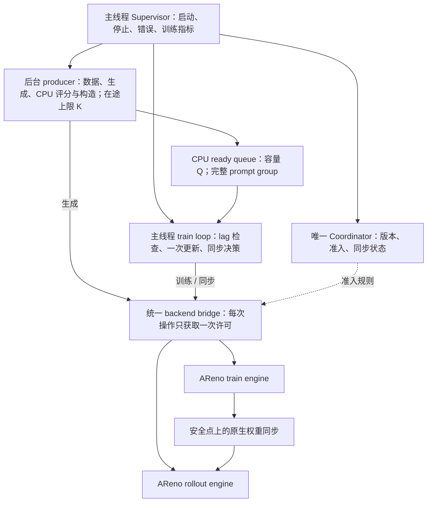

# 对照 TODO v2 的异步训练重写评估

日期：2026-09-15。评估代码：`1f73e23`、`ca97cad`；同步基线：`60e2fa7`。方案来源：`docs/ospp-async-policy@1481411` 的 [TODO v2](TODO.md) 和 [实施方案](IMPLEMENTATION_PLAN.md)。本目录原有 15 个文件已原样取回当前工作区；本评估是新增材料。

**建议：按现有方案定向重写异步控制层，保留已验证的数据与数值逻辑。** 对完整 TODO 的交付目标，这比继续在两条独立调度路径上累加补丁更合适；但没有证据支持把实验包的每个文件都重新实现。这个判断依据是状态所有权和接入结构，不是失败用例数量。

如果目标只是在当前 CPU 原型上修复已知失败，局部修复预计最快。如果目标是完成 T01–T16、接入真实双引擎并长期维护，我更倾向现在重做控制层：它尚未接入公开 Trainer / CLI，迁移牵涉较小，后续接入还必须完成一次职责整理。两条路线都需要 T06–T16 的剩余开发与 GPU 验证，不能把这些共同成本全部算成“旧代码修补成本”。本文没有实际实施两条路线，工期与收益是工程判断，不是计时结论。

**测试证据支持什么**

本轮已执行前两层本地验证，原始记录见 [实测报告](../../../runs/async-policy-cpu/report.md)、[可筛选报告和流程图](../../../runs/async-policy-cpu/report.html)、[重跑说明](../../../tests/async_policy_validation/README.md)。

- 选取的既有 CPU 回归：候选 85 项通过；同步基线上的 42 项共享测试通过。未声称整个仓库测试通过。
- 并发矩阵：216 组 Q / K / C / lag / seed 组合、3456 个 prompt 组通过所检查的不变量。30 次空输入和 50 次非空生命周期验证通过。
- 真实 CPU 小模型：4 组配置、96 个 prompt 组、49 次实际 SGD 更新、42 次参数同步；逐步独立计算的最大梯度与参数误差均为 `2.98e-08`。实际步数随线程调度可能变化。
- 固定输入的一步同步 / 异步 materialization 对照：9 类张量和数值结果最大绝对差均为 0。这支持复用对应的数据与计算逻辑，不是完整异步训练轨迹或 GPU 正确性的证明。
- 专项原始结果为 31 项、15 通过、16 失败。其中 30 项契约用例有 15 项失败，去重得到 4 项已知问题和 10 项新发现的实现或契约缺口；另 1 项是不同 loss 目标的语义比较。两项 features 用例对应同一缺口。

这些是有意覆盖错误分支的用例，不能把 `16 / 31` 当成生产故障率。问题也不等重：指标遗漏、尚未完成的初始化对齐、张量所有权契约，与同步不独占、异常后等待不结束的影响不同。

**找到原方案后的重要修正**

实施方案第 2、12 节已经明确：现有 GRPO 的 `exp(logp - logp.detach())` 数值为 1，没有使用行为策略概率构造重要性比值；首版仍复用此 loss。TODO T12 要求同目标数值对照，T14 负责质量与吞吐观察。因此 S1 探针的失败是与另一目标函数比较得到的差异，不是这两个提交引入的 bug，也不应作为重写必须变绿的验收项。原始断言和运行结果保留，仅修正解释。有限 lag 不保证质量，后续仍须按 T12 / T14 验证。

**当前实现与 TODO 的差距**

| 对应任务 | 原方案已经要求 | 本次发现 / 对重写的影响 |
|---|---|---|
| T01：契约与所有权 | 明确停止、版本、reward、metrics 的责任边界 | TODO 状态仍为“计划”，缺少随实现交付的决策记录；重写前应补一页状态所有权与转移表 |
| T02：CPU 批次交接 | 完整 group、CPU 数据、无计算图、入队后不再修改 | 正常 materialization 数值对齐已通过；N9 / N10 暴露可变张量别名与 features 检查缺口，需要快照或明确且可验证的所有权转移 |
| T03：队列和许可 | EOF 可 drain、abort 不再消费、所有等待响应 close、异常也归还许可 | N1 / N2 / N4 未满足；这些局部原语可以定点修复，不要求从零重造容器 |
| T04：同步协调 | 重复请求合并、同步独占、超时和关闭不遗漏 lease | K1 / K2 已有事件驱动反例；适合围绕明确的同步状态转移重写 |
| T05：CPU 闭环 | 异常根因传播、max_steps 收尾、无后台残留 | K3 / N3 等未满足；需要统一启动、失败、停止和清理路径 |
| T06：backend 接入 | 真实接入路径使用统一准入，隔离 SDK 可变状态 | pipeline 直接调用引擎；bridge 单独管理准入并单独测试，尚未形成一条集成路径。K4 是其中的准入反例 |
| T07：同步提交 | 初始权重对齐；部分同步失败后整体停止 | N7 / N8 暴露缺口。TODO 本就把 T07 标为部分完成，不能把尚未实现的全部接入工作都称为回归 bug |
| T08：记录 | 退出原因与等待时间可还原实际过程 | N5 / N6 是局部观测问题，保留指标结构并修正边界即可 |

实施方案第 7、8 节已经写出安全点同步、失败关闭、统一生命周期，以及不可取消 Python 线程的限制。**主要问题是这些契约没有完整落实和验收；没有必要重新发明一份完全不同的架构方案。**

资料中的 T02–T04“已验证”和 T05“CPU 闭环已验证”是原测试范围下的历史记录。结合新增反例，完整契约需要重新验收；原有 43 项通过的证据仍然有效，但不足以代表 G1 已完成。两层本地测试也不等于 TODO 的 G1 / G2：TODO 的 G2 明确要求真实双 GPU。

**建议保留和重做的边界**

| 范围 | 建议 | 原因 |
|---|---|---|
| `pipeline.py`、`coordinator.py`、`bridge.py` | 集中重写控制逻辑并统一调用路径 | 合计 816 行（含注释）；生命周期、准入、同步和清理的交叉影响集中在这里 |
| `queue.py` | 保留 Q / K 语义，修复关闭竞态，简化许可持有与移交 | 296 行；大多数容量与背压场景已通过，不必为了“重写”替换所有容器 |
| `batch.py` | 保留组语义、advantage 和 packing 对接，收紧 payload 契约 | 247 行；已有固定输入数值对照；别名和 CPU / graph 检查可以在交接边界解决 |
| 配置、事件、指标、可控 fake、小模型与验证工具 | 按需要复用 | 保留输入契约、可复现反例和独立对照，避免换实现时同时丢掉判断标准 |
| AReno 模型、loss、优化器、worker、原生权重传输 | 按 TODO 复用并验证接入 | 重写这些部分扩大范围；本轮 CPU 结果不代替它们的真实 GPU 接入验证 |

整个新实验包目前是 1748 行 Python（含注释）。上述行数只是范围量级，不是缺陷密度或工期估算。

| 路线 | 当前失败修复成本 | 完整 TODO 交付的主要风险 | 判断 |
|---|---|---|---|
| 逐个补丁，保留现有结构 | 预计最低 | 之后仍需统一 bridge 接入和多处状态 / 清理边界 | 适合尽快修复原型，不是我优先推荐的后续结构 |
| 定向重写控制层，复用数值和测试 | 初期投入较多 | 状态机设计仍可能出错，必须由同一组外部契约测试约束 | 推荐 |
| 实验包全部从零 | 预计最高 | 重付已验证工作，增加新数值和兼容性回归；GPU 任务仍未消失 | 当前证据不支持 |

**重写后的责任图（设计建议，尚未实现）**

Supervisor 唯一拥有整体生命周期与首个失败原因；Coordinator 唯一拥有版本、lease 与同步状态；bridge 适配操作与真实结果，不再维护另一套独立运行状态。其他组件调用所有者，不能保存一份会各自推进的状态副本。训练和生成均通过同一接入路径，CPU adapter 与真实 backend 共用这条路径。

关键实现约束是：许可在受控作用域内释放，数据读取和任务提交失败也不能跳过；更新版本和触发 pending sync 在一个状态转移中完成；同步成功确认后才发布可用版本，部分复制失败后关闭准入；EOF drain、max_steps 停止、abort 三种结果有明确区别。关闭先唤醒 queue / permit / lease 等待者，再回收资源，收尾超时必须报告失败。

按原方案，任意不可取消 reward 仍不在首版停止保证内。换成 asyncio 或调用 future.cancel 不能终止已经运行的 Python 函数；需要硬取消时应另行评估进程隔离。正常支持范围内必须证明清理完成，范围外也不能把仍有工作存活的运行报告为成功。

**建议调整 TODO 的执行顺序和验收**

1. **补齐 T01，并冻结外部行为。** 写清状态所有权、Q / K、一次 update、reward 取消边界、初始对齐与同步失败策略。保留现有 GRPO 目标。验收：每种状态有一个所有者，每个已知反例对应一条明确契约；有歧义的张量交接约定先固定。
2. **完成 T02–T05 的控制层替换，把 T11 可在 CPU 注入的故障提前。** 使用有界任务、单次许可移交、统一异常和关闭路径；先支持同一生成引擎 session 串行，再验证 K>1 的 CPU 阶段交错。验收：第一层 21 项用例及矩阵 / 重复生命周期检查通过，受支持的停止场景无残留，同步独占和超时有确定性反例回归。
3. **在 CPU 阶段接通 T06 / T07 的真实调用边界。** pipeline 必须经过最终使用的 bridge；两份 CPU 模型执行采样、训练和参数同步，注入初始化不一致与部分复制失败。验收：第二层 9 项契约用例通过，合计 30 项契约测试通过；固定输入的独立同步对照继续满足原容差，不能只靠修改断言变绿。S1 保留为不同目标的诊断比较。
4. **按 T09 / T10 完成真实双 GPU G2。** 先建立相同设备划分的同步基线，再跑 LoRA 异步 smoke；确认真实 optimizer updates、原生同步、缓存准备、保存 / 重载和 GPU 活动重叠。CPU 通过不代替这些证据。
5. **完成 T11–T16。** 补真实 worker / NCCL 故障回收、全参数路径、原同步 GRPO / GSPO 回归、同资源吞吐与质量、干净 checkout 复现。吞吐是否更优由 T14 数据决定，控制层重写本身不保证加速。

这次评估最需要改进的执行方式，是把原文中的契约变成提前运行的验收，并让 CPU 与 GPU 使用同一接入路径。原 TODO 将真实故障安排在 T11 是合理的，但可在 CPU 复现的同类边界不应等到第 6 周；T03–T05 本身也已经要求异常、关闭和竞态验证。

本轮已经取回方案、完成两层本地实测、整理重写范围和验收条件。生产实现没有改写；真实 AReno GPU / NCCL 接入和性能收益仍未验证。
